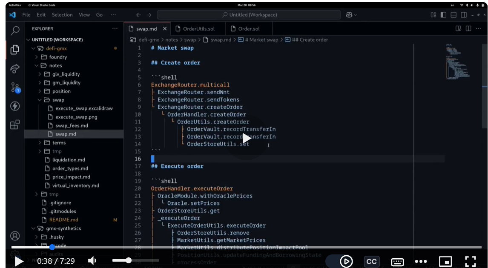

<!-- BY GOD'S GRACE ALONE -->
    <!-- BY GOD'S GRACE ALONE -->

    <!-- Scoping -->

    ~391 nSLOC
    ~327 Code Complexity
    + Copy and order the entries feom Solidity Metrics 'Source units in scope' table into a google sheet, and graciously order those files by their complexity, in order to graciously begin analysis from the least contract file to the most complex
    <!-- Recon (Simplified): EXPLORE ALL FUNCTIONALITIES IN UI, NOTE EVERY TERM AND CONCEPTS ENCOUNTERED, EXPLORE DOCS AND EVERY RESOURCE AVAILABLE BOTH PROVIDED BY PROTOCOL, AND OTHER WRITERS OUTSIDE PROTOCOL, ESTIMATE INVARIANTS, GO THROUGH CODE BASES (using slither's function-summary, contract-summary, inheritance-graph, call-graph variable-order, entry-points etc. per function with a bid to understand all a function does, have a snapshot of each part in code base/ with CTRL + F(within contract), VSCODE searh across files, foundry's method inspect command, THE END GOAL IS TO HAVE A COMPLETE CONTRACT ARCHITECURE OF THE PROTOCOL, THE CONTRACT CALLS(involving the user),  THE CALL TRACE AND CODE OUTLINE PERFUNCTION (OR PER FUNCTIONALITY), FOR ACTUAL CALL TRACES paste a transaction hash resulting from a transactionary interaction (using a functionality) into tenderly, then rewrite the call trace in markdown (SEE BELOW)  -->
    
    
    <!-- Recon ( If PROTOCOL HAS UI(such as for bug bounties or maybe for competitive audits also, it is explored first, each functionality, terms/concepts per functionality are interacted with , understood and noted WITH MUCH examples, Reading the docs, whitepapers, all offered resources ,with a purpose-negation mindset right from reading the documentation and then when reading the natspec specified purposes and properties of each function) internalizing and researching terms, finding out protocol's invariants, AND accurately depicting the entire PROTOCOL architecture) -->
    <!--Recon every require in a function is  failin point for the protocol, and every function that takes inputs is also a failure point, and these ALL SHOULD BE STALELESSLY AND STATEFULLY FUZZED, AND FORMALLY VERIFIED -->
    <!--Recon, again primary resources (aside external writings, blogs) for a PROTOCOL, are a comprehensive INTERACTION WITH PROTOCOL UI, debugging every transaction on tenderly, AND ASSIMILATING ALL protocol-originating RESOURCES (WHITEPAPERS, DOCS etc.) -->
        <!-- Check test suites(unit test suite(run coverage on protocol after graciously ensuring it can be compiled i.e. after running forge build or writing unit tests with reasonable input bounds provided into functions to GRACIOUSLY see their call traces, annotating the unit tests with their scenario descriptions(steps taken, results expected etc., and also (importantly) keeping track of the variables being monitored with 'before' and 'after' versions of those variables in each unit test), ALSO GRACIOUSLY bear in mind THE DECIMALS of each ERC20, using natspec entries like // NOTE: WBTC has 8 decimals), then assessing and NECESSARILY EVENTUALLY writing  invariant/fuzz test suite (), natspec), and so on -->
        <!-- Static analysis (slither, aderyn, compiler's build checks, ) -->
        <!-- Frequency of objects(Highlight + CTRL + F for infile frequency/occurence lookup, or using the vscode search tab for occurence lookup across the entire project(or protoccol), forge inspect Contract_name methods) and or skimming through contracts (with the function signatures as stopping points) -->
        <!-- Understanding by exemplifications(of all possible variants, lows and highs and in-betweens), concretizations, in-code explanations, this applies also to interface functions, structs etc. where the protocol using the object is explained/referenced // e this is an interface to the TSwap protocol-->

        <!-- ESSENTIAL: Understanding by diagramming (for all scenarios and it involves interactions + calls, across contracts,  function-call annotations on interactions between contracts(CONTRACT CALLS with CALL TRACES and WITH CODE-OUTLINE(algorithmic description of a function's statements[INCLUDING the affected data location (memory, storage etc,) per step, the code outline of each function or functionality can also be GRACIOUSLY derived from its(the function's or the function-sequence/functionality's call trace). the contract calls are not only MULTI-FUNCTION calls within a single contract or  across multiple contracts, but the contract calls to be diagrammed can  also GRACIOUSLY be   MULTI-CONTRACT INTERACTION FLOW i.e it must include the user, for User → V4SwapRouter → V4Router → PoolManager ), diagramming also involves using tables to describe time changes in affected variables (THE ULTIMATE BEING not only to depict the protocol comprehensively, the role of each function, contract, struct, state variable, constant (and every other object) must be GRACIOUSLy well understood and documented  (on a side note to serve as a reference while/when constructing the diagrammed contract call diagrams and their call traces and also graciously find out the invariants -->
        <!-- Recon (finding out protocol's invariantsm also by asking all along which function call sequence(s) will result in a functionality being achieved) -->

    <!-- Vulnerability Detection -->(interleaves with Recon)
        <!-- Manual review(checking FRE-PI/CEI on each function, also negating the purpose once uncovered or understood also), checking with tests, manual review checking with tests, manual review(checking FRE-PI/CEI on each function, also negating the purpose once uncovered or understood also), checking with tests, recon, recon,..the cycle repeats. -->

    <!-- Reporting(Initial for private audits and final for competitive audits) -->

# Derivatives from Recon

# Terms

Liquidity Provider: Someone who deposits money into a protocol to earn interest
-   Where is the interest coming from?
-   Thunder Loans: Do fees come from loans?

Thunderloan:

Token --> deposit --> assetToken

## About protocol in one's own words

## Potential attack vectors,

## Ideas

## Questions

Why are we using TSWAP? What does that have to do with this protocols
